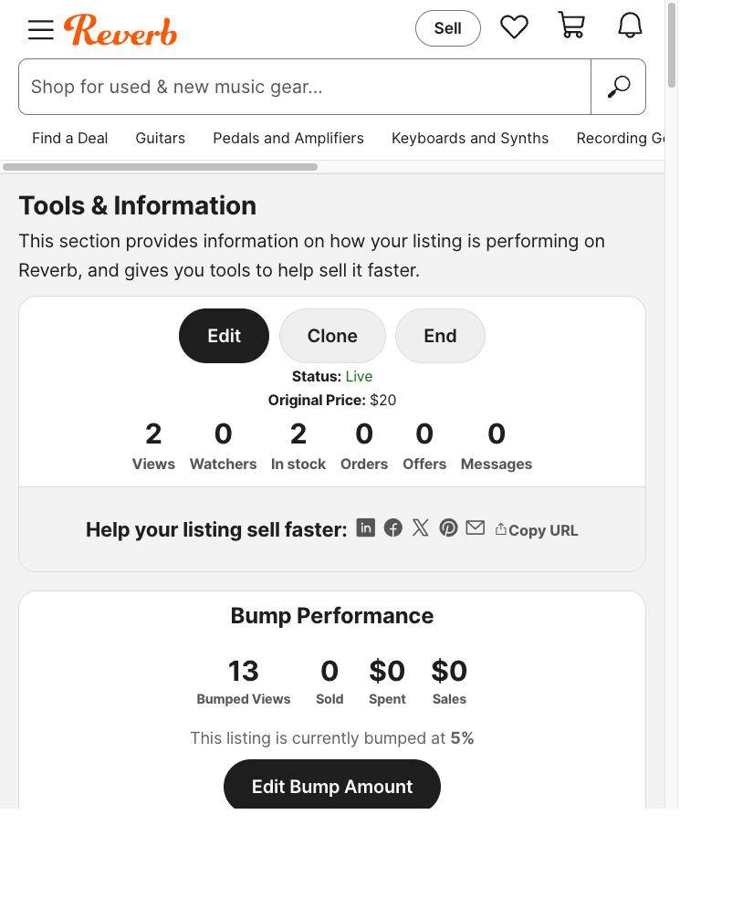
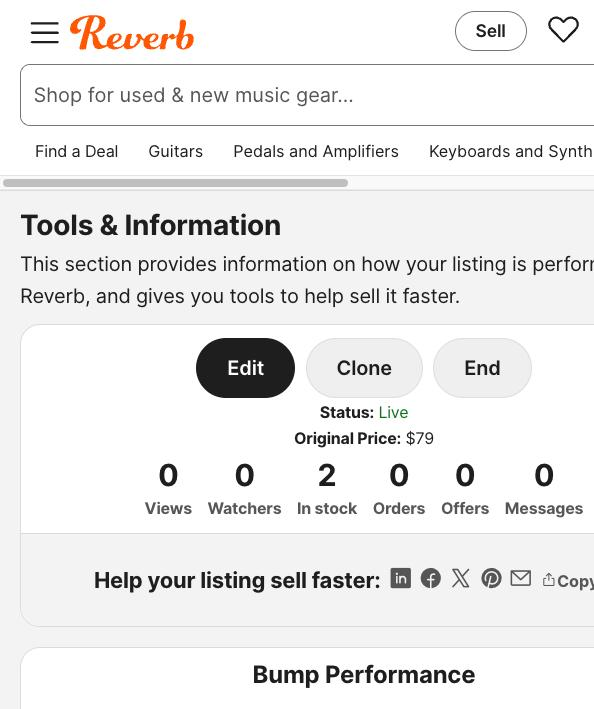
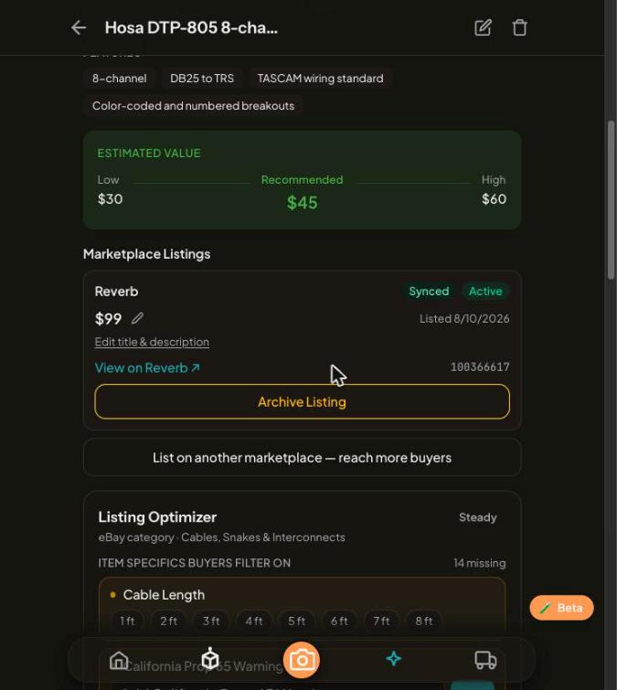
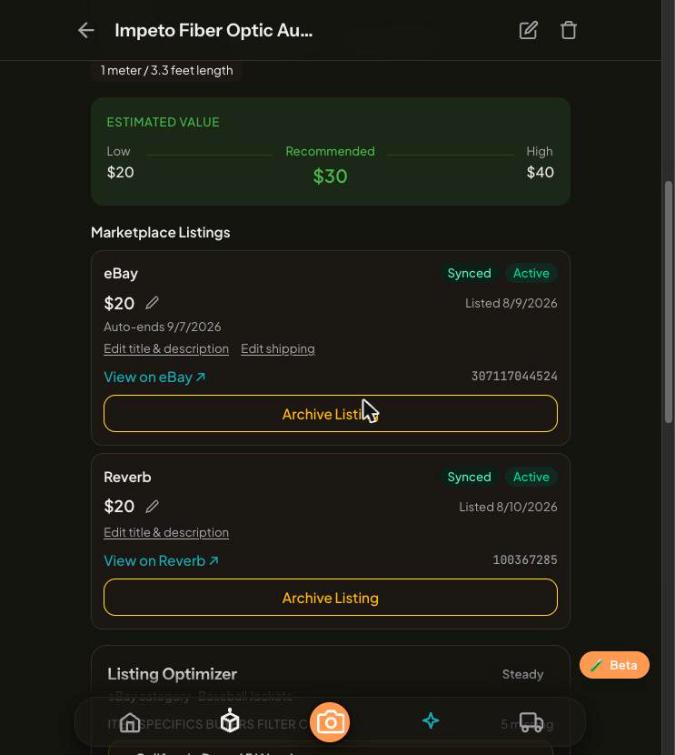

# Proof of Done — Phase 2 ship + Reverb blank-model fix

Captured 2026-08-10 ~21:40 ET, immediately after merge + deploy. Every section
is a fresh observation from the live system, not a claim from memory.

## 1. PR #299 merged

```
PR #299: MERGED at 2026-08-11T00:59:11Z, merge commit 5044535
```

## 2. Deployed container healthy (rebuilt from main)

```
{"status":"ok","timestamp":"2026-08-11T01:37:20.489Z"}
portage-api Up 37 minutes (healthy)
```

## 3. Quality gates (merged main)

```
api:  Tests  909 passed (909)
web:  Tests  631 passed (631)
typecheck: clean
lint: 0 errors (26 pre-existing warnings)
```

:::note One flaky web run during proof capture
The first proof-gathering run recorded `1 failed | 630 passed (631)` on the
web suite; the capture script's grep dropped the failing test's name. The run
before it (21:50 UTC) and the verification re-run after it were both 631/631
green, and PR #299's CI web suite passed. Treated as an unidentified flake —
watch item, not a regression. Recorded here because the first proof delivery
mistakenly reported that run as 631/631.
:::

## 4. Database truth — both listings active with real Reverb ids

```
 marketplace_listing_id | status | title
------------------------+--------+------------------------------------------
 100366617              | active | Hosa DTP-805 8-channel DB25 to 1/4" TRS
 100367285              | active | Impeto Fiber Optic Audio Cable 3.3ft
```

## 5. Reverb API truth (public endpoint, independent of Portage)

```
100366617 live | inventory: 2 | Hosa DTP-805 8-channel DB25 to 1/4" TRS Snake
100367285 live | inventory: 2 | Impeto Fiber Optic Audio Cable 3.3ft, Toslink
```

## 6. Reverb owner view (logged-in seller account)

Impeto — Status: Live, $20, 2 in stock, Bump 5%:



Hosa — Status: Live, 2 in stock:



## 7. Error class eliminated

Zero `"Localized contents model for English can't be blank"` 422s in API logs
since deploy (00:59 UTC). Before the fix: 4 failed publish attempts across
08-09/08-10 on these two items.

## 8. Portage app — "Sync failed" banner gone

Hosa card — Reverb **Synced + Active**, $99 (operator-set at publish; DB and
Reverb cross-checked equal), listing id linked:



Impeto card — Reverb **Synced + Active**, $20 (eBay card also Active):



---

**What was proven:** the Phase 2 marketplace-truth-sync program (PR #299) is
merged, deployed, and healthy; the Reverb blank-model publish fix works
against the real marketplace (omit `make`/`model` when absent — an explicit
`""` fails Reverb's localized-contents validation); and both previously-stuck
listings are live end-to-end: Portage DB → Portage UI → Reverb API → Reverb
seller dashboard.
