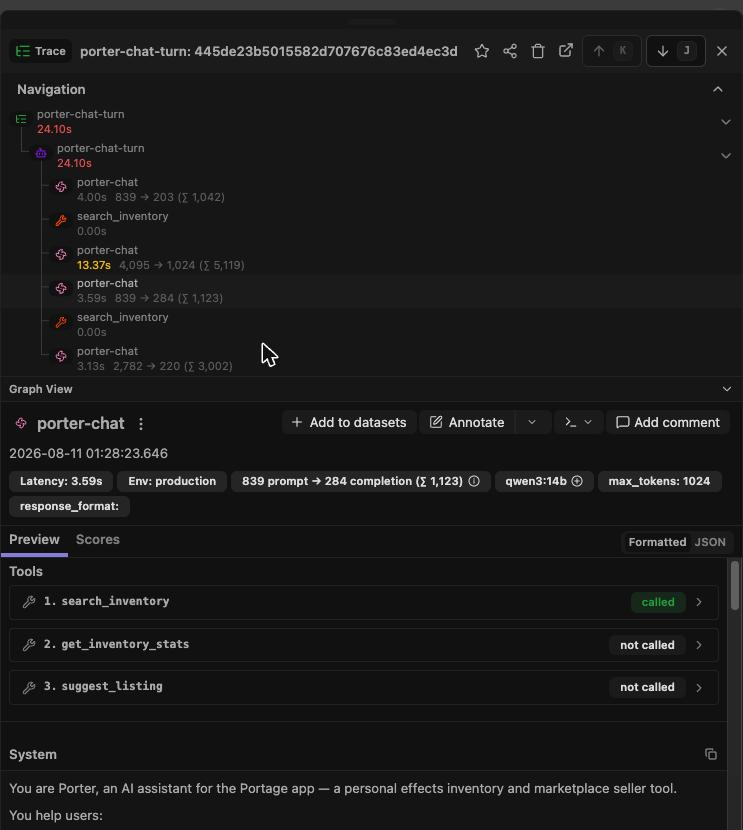
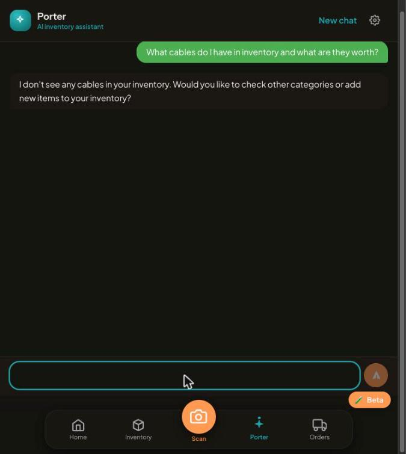
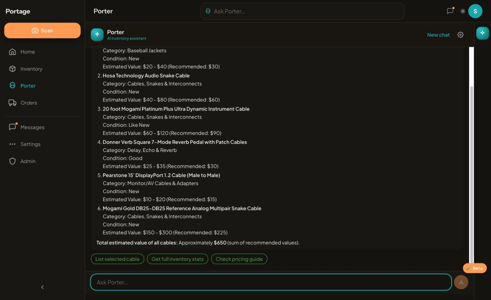

# Proof of Done — Phase 3a Porter reliability + grounding validation

:::info COMPLETED 2026-08-13 — see §10 for the closing proof
This bundle was kept under an INCOMPLETE banner from 2026-08-11 to 2026-08-13
because sections 2–3's live "successes" were found factually wrong against the
DB (false-negative "no cables" reply; a fabricated item in a follow-up turn) —
incident record in
`docs/session-reports/2026-08-11-phase3a-grounding-incident-and-model-eval.md`.
The banner's own exit condition — model decision landed, a clean live run
verified item-by-item against the database, screenshot delivered — was met on
2026-08-13 with **granite4.1:8b** (which superseded the gemma4:12b
recommendation after a 4-source model research pass and a 125-prompt eval).
§10 carries that proof.
:::

Captured 2026-08-11 ~01:30 ET against the live `portage-api` container rebuilt
from `feat/porter-reliability-3a` (pre-merge live proof, same pattern as
Phase 2). Every section is a fresh observation from the running system.

## 1. What shipped

- **3a.1** — `/porter/message` blank-reply fix: `reasoning_effort` now passed on
  non-streaming create calls; an empty reply is a failed call that fails over
  down the provider chain (streaming path got the same guard via advisor A1).
- **3a.2** — empty provider chain now throws `AppError(503, 'AI_UNAVAILABLE')`
  from `buildChain`; the dead guard it obsoleted was removed.
- **3a.3** — Langfuse generations named per purpose (`porter-chat`,
  `scan-vision`, `prepare-listing`) via `AIOptions.purpose`.
- **3a.4** — `provider:model` chain entries now set `chatModel` (previously
  vision-only).
- **Grounding validation** (operator-approved 08-10): every item name Porter
  lists is checked against tool-returned inventory titles. Mismatch = failed
  provider call → one same-provider retry → chain fail-over (attempt 3 on the
  stream path forces gemini) → degrade-with-log after 3 attempts or a 45s turn
  budget. Streaming uses buffer-after-first-tool so ungrounded replies are
  discarded server-side before the client sees them.

## 2. Live executed proof — `/porter/message` non-empty (3a.1)

```
STATUS: 200
MESSAGE LENGTH: 245
MESSAGE: Donner Verb Square 7-Mode Reverb Pedal with Patch Cables | good | $25–$35
<actions>[{"label":"List this item", ...}]</actions>
```

Real inventory row, real values, grounded reply — the blank-reply class this
task existed for did not reproduce.

## 3. Grounding validator fired live on the first real turn

The very first production turn after deploy exercised the whole mechanism
unprompted — qwen3:14b emitted an item-shaped line that wasn't in the tool
results, the validator rejected it, the same provider was retried once, and the
retry served a grounded reply:

```
WARN  ai-client  provider=local  "Ungrounded item in Porter reply: \"Estimated
                 Value Range\" not in tool results"
                 msg="Chat validation failed, retrying provider once"
INFO  ai-client  provider=local model=qwen3:14b elapsed=24100 fallbacks=0
                 msg="Chat complete"
INFO  porter     msg="Porter message processed"  → HTTP 200
```

## 4. Langfuse per-purpose generation names live (3a.3)

Observations API, before vs after deploy:

```
porter-chat | qwen3:14b        | 2026-08-11T05:28:27   ← after (×4, incl. retry)
porter-chat | qwen3:14b        | 2026-08-11T05:28:06
OpenAI.chat | gemini-2.5-flash | 2026-08-10T22:43:32   ← before (generic)
```

## 5. Quality gates (branch tip)

```
api:  Tests  941 passed (941)     ← 909 at Phase 2 close; +32 this phase
typecheck: clean (all workspaces)
lint: 0 errors (26 pre-existing warnings)
```

## 6. Review ledgers — every finding fixed or operator-dispositioned

- `/code-review high`: **7 findings, all FIXED** pre-commit (chatStream
  forceProvider no-op, retry frame duplication, comma-format bypass,
  advice-line false positive, empty-normalized-title whitelist, stale
  photo-less comment + validate hook, token accounting).
- **Advisor pass (A1–A9)**: A1–A7 + A9 FIXED with red→green tests. A8 (stream
  abort wiring on client disconnect) = operator-approved deferral
  ("slot in 3b", 2026-08-11 01:26 ET), filed in the registry
  (`e95934b4-afc1-4365-ad71-73aa2bd5b880`) and slotted as task **3b.0** in the
  ship-program task list.
- Advisor verified clean: no message-history pollution across retries; Langfuse
  client memo bounded (provider × purpose).

## 7. Deployed container healthy

```
{"status":"ok","timestamp":"2026-08-11T05:27:50.796Z"}
portage-api Up (healthy), rebuilt from feat/porter-reliability-3a
```

## 8. Screenshots (captured ~04:30 ET via live browser)

**Langfuse trace — per-purpose names + grounding retry visible** (3a.3 spec
verify): `porter-chat-turn` root, nested `porter-chat` generations,
`search_inventory` tool spans, `qwen3:14b`, Env production, zero error spans:



**Live Porter UI turn on the streaming path** — and the server log for this
exact turn shows the grounding loop firing invisibly: attempt 1's draft
contained an ungrounded "Estimated Value" line, was discarded server-side
(buffered, never rendered), and attempt 2's clean grounded reply is what the
user saw:

```
WARN porter attempt=1 "Ungrounded item in Porter reply: \"Estimated Value\"
     not in tool results" msg="Porter stream reply failed grounding, retrying"
INFO ai-client provider=local elapsed=4796 msg="Chat stream complete"
```



## 9. Watch items (honest notes, not defects)

- The conservative validator flagged a summary-ish "Estimated Value…" line as
  an item on BOTH live turns captured in this bundle (§3 non-streaming, §8
  streaming) — each self-healed via one retry, invisible to the user, degrade
  never fired. Recurring pattern → summary-header stopword candidate for
  `porter-grounding.ts` (costs one retry ≈ 5-28s latency per affected turn).
- `/porter/message` (non-streaming fallback) returns the raw `<actions>` block
  in `message` — pre-existing behavior, untouched by this phase; the streaming
  path parses pills server-side.

## 10. Closing proof — clean live run, item-by-item DB verify (2026-08-13)

Model decision: **granite4.1:8b** primary (`CHAT_PROVIDERS=local:granite4.1:8b,gemini`),
superseding the gemma4:12b recommendation. Basis: 4-source research pass
(HuggingFace / Ollama / LM Studio / NVIDIA, under 11B, released Feb–Aug 2026),
then the same eval harness used for gemma — 25-prompt realistic battery ×3
passes (24/25 each; sole fail was a harness iteration-cap artifact that
completes at prod's 10-iteration cap) + a 50-prompt soak (50/50 after two
scorer false-positives were verified grounded by hand). **125 prompts, zero
fabrications, ~1.0s average turn (vs 6.9s gemma4:12b).** No reasoning-effort
wiring needed — that task dropped with the model switch.

Live PoD exposed one eval-blind defect first: the prod `search_inventory`
tool result carried each item's full `photos` JSONB (~80% of payload), which
granite misread as duplicate listings ("image crop & exposure variations").
Fixed same session — photos stripped from the tool result (no consumer
existed; the web client renders text blocks only), test inverted, 944/944.

Clean-run verify, live app UI, "What cables do I have in inventory and what
are they worth?": **6/6 items returned, every title / condition / min / max /
recommended value / category matching the items table field-by-field** (query
scoped to the asking user; earlier "10 cable items" ground truth was an
unscoped query counting snake-titled items and other users). The one oddity
in the screenshot — category "Baseball Jackets" on the Impeto cable — was the
DB's own data (a bad eBay Taxonomy suggestion silently accepted at scan time,
since hand-corrected by the operator; guard plan:
`docs/plans/2026-08-13-category-mismatch-guard.md`), reported faithfully by
the model.



Honest defect, open: the reply's closing "Total ≈ $650" is model arithmetic —
true sum of the six recommended values is $450. Items grounded, math not.
Mitigation candidate: system-prompt nudge to use `get_inventory_stats` for
totals instead of hand-summing. Tracked, not hidden.
