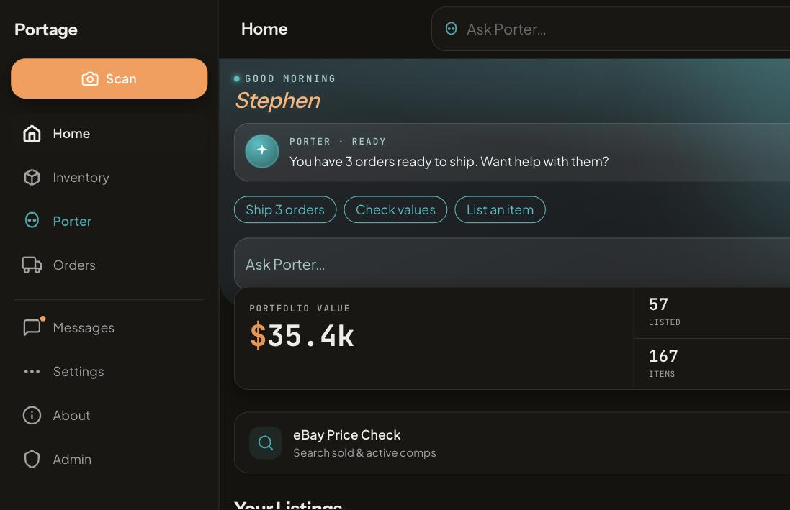
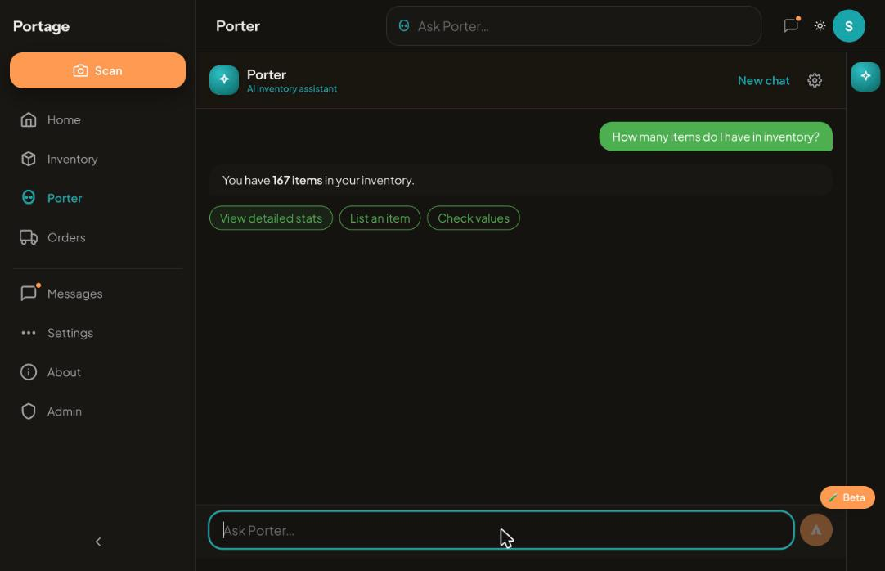
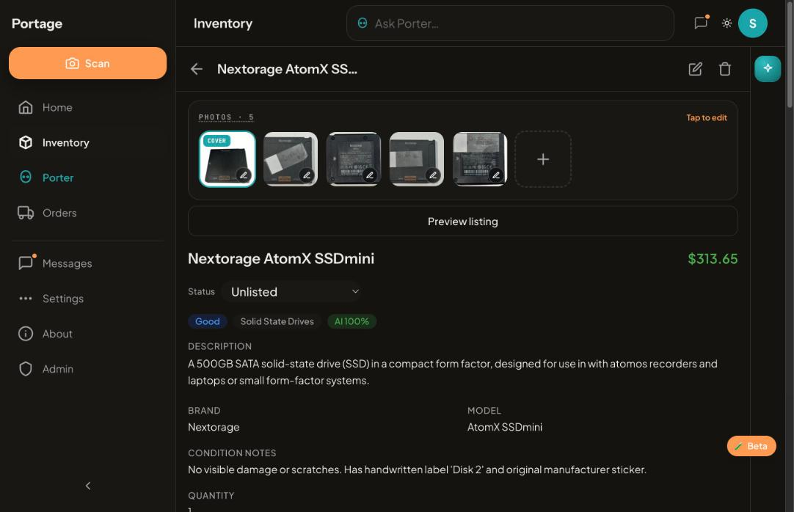
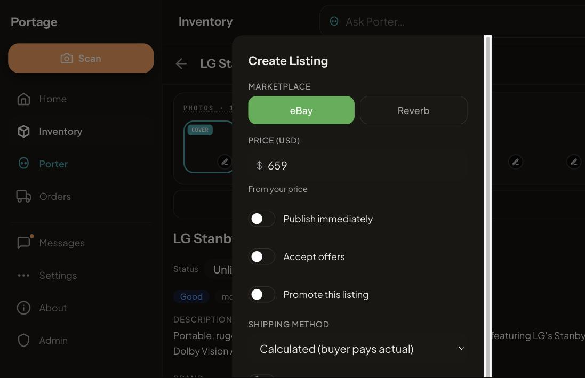
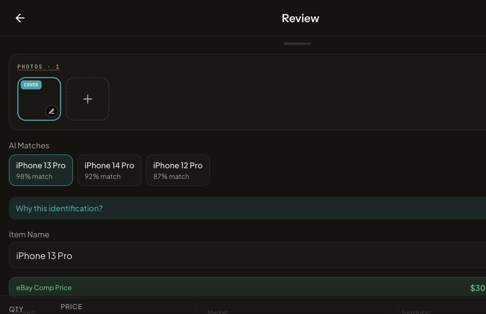

# Proof of Done — P6 dependency majors

Captured 2026-08-27 03:00–03:20 ET against `portage-api` + `portage-app`
rebuilt from `feat/p6-dependency-majors` @ `0acb32e` (`node:24-slim`
images, `node -v` → v24.19.0 in both). Everything below ran against the
production API and the real eBay seller account — no mocks.

## What changed underneath

| Dependency | Before | After |
|---|---|---|
| Node runtime (Dockerfiles ×6, CI ×4, .nvmrc, engines) | 20 | 24 |
| TypeScript | 5.9.3 | 6.0.3 (`~6.0.0`; TS 7 blocked by typescript-eslint peer `<6.1`) |
| @types/node (api) | 22 | 24 (web stays 25) |
| vitest / vite | 3.2.7 / 7 | 4.1.11 / 8 |
| zod (api) | 3.25.76 | 4.4.3 |
| pino / pino-http | 9.14 / 10.5 | 10.3.1 / 11.0.0 |
| eslint (web) | 9.39.5 + eslint-config-next | 10.9.1 + composed plugin stack |
| next | 16.2.11 | 16.3.3 (via `npm audit fix`) |
| `npm audit` high | 4 | 0 |

Gates on the final tree: typecheck 0 errors (3 workspaces), api 1061/1061,
web 705/705, lint 0 errors / 27 warnings (identical to the pre-P6 baseline:
18 `no-img-element`, 9 `exhaustive-deps`), fresh-directory `npm ci` OK.

## Live smoke on the deployed branch

**Containers.** `docker compose ps`: both `healthy`; `/health` 200 in
2.9–3.9 ms ×3; zero `level>=50` boot lines.

**Redaction on real traffic (pino 10 / `@pinojs/redact`).** Every
authenticated request logged `authorization: [REDACTED]` and
`cf-access-jwt-assertion: [REDACTED]`; a canary-header probe on a throwaway
dev API (`:8123`) confirmed `cookie` too and no canary string anywhere in the log.

**Home.** Dashboard loads (167 items, 57 listed → 58 after the publish below).

**Porter.** "How many items do I have in inventory?" → streamed "You have
**167 items** in your inventory." with action pills — exercises the new
`StreamingBlock.id` keys, the `messageKeys()` helper, React 19 `use(Ctx)`
providers and the `z.guid()` conversationId path. No console errors.

**Inventory + item detail.** 167-item grid with data-driven category chips;
detail page renders photos, status control, aspects.

**Draft payload.** Create-listing sheet with "Publish immediately" off; a
`fetch` interceptor captured and blocked the POST — body was
`publishMode: "draft"` (no marketplace call). The one-click double POST seen
in the capture is `api.ts`'s by-design retry after a thrown fetch, deduped
server-side by the idempotency key.

**Live publish (incidental).** An earlier coordinate click by the browser
tool landed on the "Publish immediately" toggle before submitting, so the
Nextorage AtomX SSDmini went live as eBay **307148927654** via
`AddFixedPriceItem` in 2.6 s — `disclaimer_acceptances` recorded the
publish-now consent, proving the client sent live mode. Not a P6 regression
(sheet, hook and route are byte-identical to `main`); it does prove the full
Trading API path on the new runtime.

**Scan → review.** Gallery upload (`POST /images` 201, 330 ms — sharp on
Node 24) → "Scan 1 Photo with Porter" → `POST /scan/refine` 201 in 23.8 s →
Review with three candidates, eBay comps ($219 / $300 / $384, 25 sold). The
local `qwen3-vl` provider failed with "AI returned unparseable response" and
failed over to Gemini — Loki shows the same failure on 08-20/22/24/25/26, so
it predates P6.

## Behavior changes shipped with zod 4

- 400 `details` message text changed (`Invalid uuid` → `Invalid GUID`,
  `Required` → `Invalid input: expected …`); status and shape unchanged, no
  consumer asserted on the old text.
- `limitOverrides` (admin PATCH) is `z.partialRecord` — v4's enum-keyed
  `z.record` became exhaustive and would have 400'd partial overrides.
- `.uuid()` sites use `z.guid()` deliberately: v3's permissive regex, so
  non-RFC test fixtures and any legacy ids keep validating.
