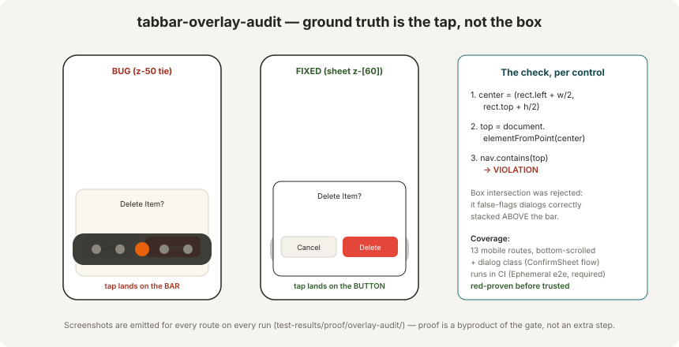

# tabbar-overlay-audit — the pixel-level CI gate

**File:** `apps/web/e2e/tabbar-overlay-audit.spec.ts` · **Runs in:** the required **Ephemeral e2e** check on every PR to `main` (plus any local `npm run test:e2e`) · **Shipped:** PR #266, 2026-07-27.

## The failure it exists to kill

Beta report `7c9a499b`: the floating TabBar covered the publish sheet's submit button. PR #262 fixed the **reported instance** (scan-flow publish sheet + one z bump) and claimed done on green tests. The reporter came back the same day: *"the bottom bar is still overlaying submit buttons on some pages."*

An audit then found the **class**: six more bottom sheets at `z-50`, tying with the TabBar (`z-50`, rendered later in DOM — later sibling wins ties), so the bar painted over their action buttons:

| Surface | Impact |
|---|---|
| `ui/confirm-sheet.tsx` | **every delete confirmation in the app** |
| `listing/aspect-fill-sheet.tsx` | eBay required-specifics fill during publish |
| `listing/weight-fill-sheet.tsx` | weight/dims fill during publish |
| `comps-search-sheet.tsx` | comps lookup |
| `listing-flow/photo-capture-flow.tsx` | hybrid-flow capture |
| `admin/users/page.tsx` modal | admin user management (compact bar on admin mobile) |

All lifted to `z-[60]`. The gate exists so neither the regression **nor the claim pattern** ("instance fixed, class assumed") can recur silently.



## How it decides — `elementFromPoint`, not bounding boxes

For every visible interactive element (`button, a, input, select, textarea, [role='button']`) outside the bar:

1. Compute the element's **center point**.
2. `document.elementFromPoint(center)` — the browser's own answer to *"where would a tap land?"*
3. If the topmost element belongs to the bar's `nav` → **violation**, reported with the control's label.

**Bounding-box intersection was implemented first and rejected**: a dialog correctly stacked *above* the bar still overlaps the bar's box (its backdrop covers the bar by design) and box-math flags it. The first green run of the fixed dialog failed the box version — the check, not the fix, was wrong. `elementFromPoint` ignores `pointer-events: none` layers (the bar's gradient shim) and respects real stacking, making it exact.

## Coverage

**Test 1 — route sweep.** 13 mobile routes at iPhone-12 viewport (390×844), each scrolled to the bottom (where submit buttons live and the bar bites), 400ms settle for the bar's compact/expand transition, then the occlusion check:

```
/home /inventory /porter /orders /listings /messages /beta/report
/settings /settings/{seller-profile,billing,marketplace,notifications,help}
```

**Test 2 — dialog class.** Seeds a real item over the API, opens the item page, triggers the Delete flow, asserts the ConfirmSheet's Cancel/Delete take the tap, then **actually clicks** — Playwright's actionability check is a second, independent proof (a covered button times the click out). Fixture cleaned up in `finally`.

**Proof as a byproduct:** every run emits a per-route screenshot to `test-results/proof/overlay-audit/` (`ok_*.png` / `FAIL*.png`) — visual evidence is produced by the gate itself on every CI run, not as a separate manual step.

## The red-proof

Before its green was trusted, the gate was made to catch the real bug:

1. `confirm-sheet.tsx` deliberately reverted to `z-50`; container rebuilt.
2. Audit run → **FAILED**: `TabBar occludes dialog controls: Cancel, Delete` — with the occluded-state screenshot captured as the "before" evidence.
3. Fix restored; rebuilt; audit green; before/after screenshots delivered to the operator **prior to any "done" claim**.

*A gate that has never gone red is just another promise.* The red-proof is now part of the standard for adding any new gate (see [Operations](./operations.md)).

## Extending the audit

- **New route** → add to the `ROUTES` array; the sweep, screenshots, and assertion apply automatically.
- **New dialog surface** → add a test-2-style step driving it open, reuse `overlappedControls(page)`.
- **New fixed chrome** (a second bar, a floating widget) → generalize the `nav` selector to a list of chrome roots; the per-control check is chrome-agnostic.
