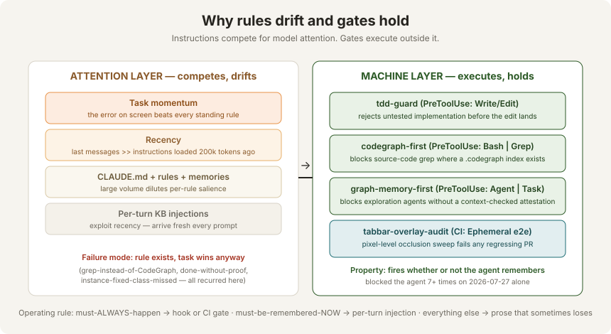

# Trust Gates

**The machine-enforcement layer: three PreToolUse hooks and one CI gate that make recurring agent failure modes structurally impossible instead of behaviorally discouraged.**

All four were installed or hardened on **2026-07-27**, during a single session in which every one of them subsequently blocked the agent at least once — which is the point.

## The core finding

Behavioral instructions to an AI agent — CLAUDE.md, rule files, memories — are **suggestions competing for attention**. Three forces reliably beat them:

1. **Task momentum.** Mid-debug, "chase this error" out-competes every standing rule. The rule isn't forgotten; it loses the auction.
2. **Recency.** Instructions loaded at the top of a session have almost no pull 200k tokens later, when the freshest tool error dominates.
3. **Volume dilution.** Two CLAUDE.md files, twelve rule files, 125 memories, per-turn injections: each additional standing rule lowers the salience of every other one. They compete with *each other* as much as with the task.

There is no hidden priority list where anything outranks the operator's instructions — the failure is attention physics, not rank. The registry captured this as an insight well before it was acted on:

> *"AI behavioral rules are suggestions competing for attention — move enforcement to deterministic hooks that fire at infrastructure level."*

**tdd-guard proved the model for months**: the one discipline that never drifted was the one a validator enforced by rejecting the tool call. On 2026-07-27 the remaining repeat-corrected behaviors were moved into the same layer.

## The operating rule

| Requirement class | Correct layer | Why |
|---|---|---|
| Must **always** happen | Hook (PreToolUse) or CI gate | Executes outside attention; blocks the action itself |
| Must be remembered **now** | Per-turn injection (memreg UserPromptSubmit/KB hooks) | Exploits recency — re-arrives fresh every prompt |
| Everything else | CLAUDE.md / rules / memories | Prose that will sometimes lose, acceptably |

## Gate inventory

| Gate | Layer | Intercepts | Failure mode it kills | Born from |
|---|---|---|---|---|
| [tdd-guard](./tdd-guard.md) | PreToolUse hook (plugin) | `Write` / `Edit` on `apps/api` + `apps/web` | Untested implementation; over-implementation past the failing test | Long-standing; the proof-of-concept for the whole layer |
| [codegraph-first](./search-discovery-gates.md#codegraph-first) | PreToolUse hook, global (`~/.claude/settings.json`) | `Bash` + `Grep` | Grepping source code for symbols when a CodeGraph index exists (token burn, repeated-instruction #1) | 2026-07-27 token-efficiency escalation |
| [graph-memory-first](./search-discovery-gates.md#graph-memory-first) | PreToolUse hook, global | `Agent` / `Task` | Dispatching exploration agents blind — without consulting KB, CodeGraph, graphify, memory first | Same session, same escalation |
| [tabbar-overlay-audit](./overlay-audit-gate.md) | CI gate (required "Ephemeral e2e" check) | Every PR to `main` | UI-occlusion regressions; "fixed the instance, missed the class"; "done" claimed without pixel-level proof | Beta report `7c9a499b` recurring after PR #262 |

## Properties every gate shares

1. **Fires regardless of agent intention.** The agent was blocked 7+ times by these gates on installation day — including on false positives, which is evidence of the property, not a defect of it.
2. **Pipe-tested before registration.** Synthetic stdin payloads for every branch (7 cases for codegraph-first, 10 after the Grep extension; 10 for graph-memory-first).
3. **Live-fire proven.** Each hook demonstrably blocked a real agent action after registration (a real `grep`, a real `Explore` dispatch).
4. **Red-proven where applicable.** The CI gate was made to FAIL against the deliberately reintroduced bug before its green was trusted. *A gate that has never gone red is just another promise.*
5. **Visible to the operator.** `/hooks` lists the hooks; the CI check appears on every PR; nothing lives only in agent memory.

## What remains promise-layer (known gaps)

- **Screenshot-proof delivery** ("proof is delivered, not offered") is enforced only by memory + the Definition-of-Done rule. A pre-push hook — block `git push` when the diff touches `apps/web` UI files unless fresh screenshots exist under `test-results/proof/` — has been designed but not yet built.
- **graph-memory-first attestation is honor-based**: the agent could write `[context-checked: ...]` without honest consultation. The marker's value is that it is *auditable in every dispatched prompt* — a vague attestation is the tell.
- **codegraph-first false positives** (see [known FPs](./search-discovery-gates.md#false-positives)) are worked around, not yet fixed in the regex.

## See also

- [Search & Discovery Gates](./search-discovery-gates.md) — codegraph-first + graph-memory-first in full
- [tdd-guard](./tdd-guard.md) — the original deterministic gate
- [Overlay Audit CI Gate](./overlay-audit-gate.md) — the pixel-level UI gate and its red-proof
- [Operations](./operations.md) — file locations, verification protocol, adding/disabling gates
