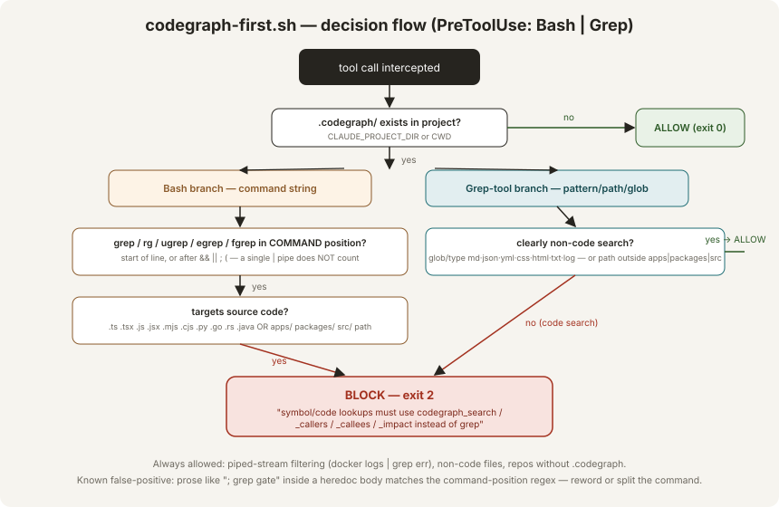
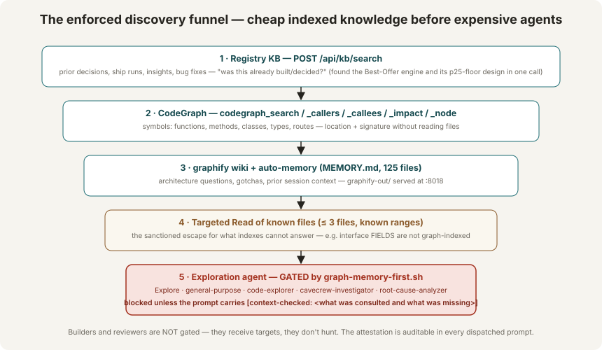

# Search & Discovery Gates

Two global PreToolUse hooks (they apply to **every project on g700data1**, activating only where the project carries the relevant index) that force the cheap-indexed-knowledge path before the expensive one.

**Origin (2026-07-27):** a token-use audit showed the agent grepping source files for symbols dozens of times per session and dispatching Explore agents for questions the registry KB and CodeGraph could answer — despite the CLAUDE.md rule ("Symbols → CodeGraph, never grep") standing the entire time. Repeated-instruction corrections had failed four times in seven days. Both behaviors were moved to the hook layer the same day.

## codegraph-first

**File:** `~/.claude/hooks/codegraph-first.sh` · **Registration:** `~/.claude/settings.json` → `hooks.PreToolUse`, matcher `Bash|Grep` · **Active when:** `$CLAUDE_PROJECT_DIR/.codegraph/` (or `$PWD/.codegraph/`) exists.



### Bash branch

Blocks (`exit 2`, message fed back to the model) when **both** hold:

1. `grep` / `rg` / `ugrep` / `egrep` / `fgrep` appears in **command position** — start of line, or after `&&`, `||`, `;`, `(` (optionally prefixed by `sudo` / `command`). A grep after a single `|` pipe is stream filtering and always passes.
2. The command **targets source code** — any token with a code extension (`.ts .tsx .js .jsx .mjs .cjs .py .go .rs .java`) or a path under `apps/`, `packages/`, `src/`.

### Grep-tool branch

The dedicated `Grep` tool was a complete bypass of the Bash gate until the matcher was extended to `Bash|Grep`. The branch **allows** clearly non-code searches — glob/type of `md json yaml css html txt log`, or an explicit `path` outside `apps|packages|src` (e.g. `docs/`, `website/`, `.github/`) — and blocks everything else.

### What the block message teaches

The rejection names the sanctioned tools verbatim: `codegraph_search / codegraph_callers / codegraph_callees / codegraph_impact`, and states the carve-outs (non-code files, piped streams). The correction arrives **at the moment of violation** — maximum recency, zero reliance on standing memory.

### The sanctioned escape ladder

CodeGraph indexes **symbols** (functions, methods, classes, types, routes). It does **not** index interface *fields* or object-property references. When a field must be traced (`bestOfferAutoAcceptPrice` was the day-one case):

1. `codegraph_search` for the owning symbols → file:line anchors.
2. **Targeted `Read`** of those known files/ranges (≤ 3 files — the Read tool is never gated).
3. Wider than 3 files / unknown scope → **attested Explore dispatch** (next gate).
4. One-off text scans in a pinch: `python3` file reads (not gated) — used for the z-50 overlay sweep.

### False positives {#false-positives}

Two known classes, both observed live on day one; both worked around, neither yet fixed in the regex:

| FP class | Example | Workaround |
|---|---|---|
| Prose in heredoc bodies matching command-position regex | journal text `"; grep gate blocked …"` inside a `cat <<EOF` | Reword the prose ("search gate") or split the command |
| Mixed compound commands — grep on a non-code file while another part of the same command mentions a code path | `grep pat /tmp/log.txt; ls apps/web/…` | Split into separate Bash calls |

The asymmetric cost is deliberate: a false block costs one reworded command; a false allow re-opens the token-burn hole.

### Live-fire record (installation day)

- Blocked `grep -n "requestExchange" apps/web/src/lib/api.ts` immediately after registration; `codegraph_search` answered the identical query from the index.
- Blocked two field-reference greps during the accept-offers build — both correctly routed to targeted Reads + one attested Explore.
- Two false positives (classes above) — reworded, work continued.

## graph-memory-first

**File:** `~/.claude/hooks/graph-memory-first.sh` · **Registration:** `hooks.PreToolUse`, matcher `Agent|Task` · **Active when:** the project has `.codegraph/` **or** `graphify-out/`.



### What it gates

Only **exploration-class** agent types — the ones whose job is hunting:

```
Explore · general-purpose · feature-dev:code-explorer ·
caveman:cavecrew-investigator · root-cause-analyzer
```

Builders, reviewers, and specialized workers are dispatched with targets already known and pass untouched.

### The attestation contract

A gated dispatch is rejected unless its prompt contains a `[context-checked: ...]` marker **naming what was consulted and what was missing**. A compliant real example from day one:

```
[context-checked: registry KB gave the Stage-2 best-offer design (p25 floor,
opt-in default-off); codegraph_search located bestOfferDetails /
buildAddFixedPriceItemXml / EbayPreparedFields but cannot index FIELD
references, which is exactly what I need; MEMORY.md has no setter locations]
```

The attestation is honor-based by construction — but it is **auditable in every dispatched prompt**. A marker that names nothing specific is the tell that consultation didn't happen.

### Live-fire record

Blocked an un-attested `Explore` dispatch ("list files in apps/api/src/routes") immediately after registration — before the agent process was ever spawned, i.e. before any tokens were spent on it.

## Measured effect

Same-day comparison, accept-offers feature discovery vs the morning's grep-driven work: one KB call surfaced the entire prior Best-Offer design (p25 floor, prepared-fields carry, opt-in decision), three CodeGraph calls located every symbol, and a single *attested* Explore filled only the unindexable gap — versus dozens of greps and blind file reads earlier in the session. The hooks did not slow the work; they re-routed it.
